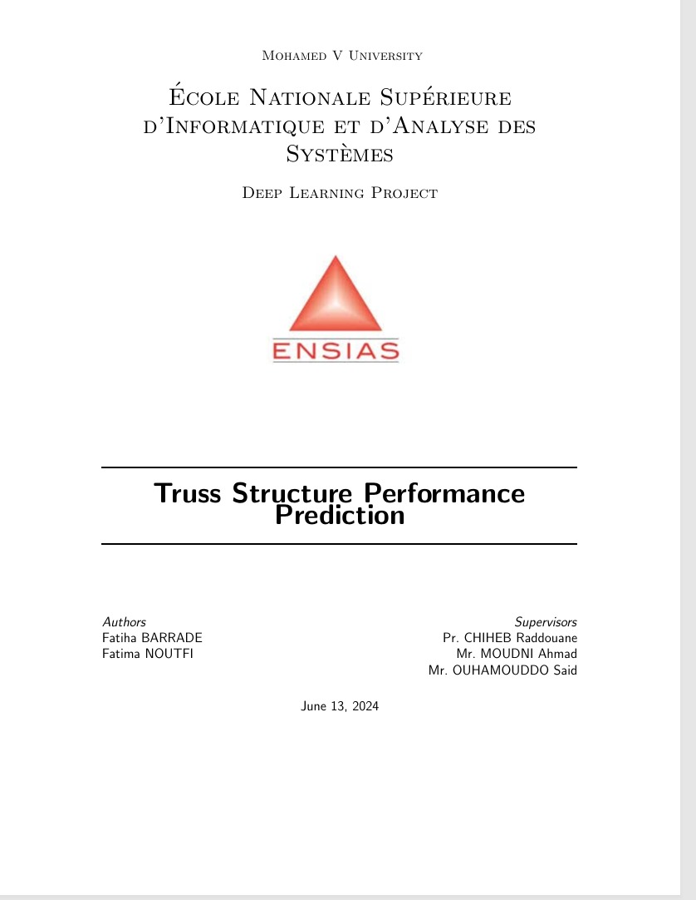

# Truss Structure Analysis with Regression and CNNs

## Overview
This project uses machine learning techniques to predict weight and energy values for truss structures and employs Convolutional Neural Networks (CNNs) for stability classification. Aiming to enhance structural safety and optimization in civil engineering, this work offers engineers tools for analyzing structural characteristics and making informed safety decisions.

## Abstract
This project applies regression models to predict weight and energy values of truss structures and CNNs to classify stability. These models assist in structural optimization and safety evaluation, providing engineers with valuable insights. With data preprocessing and model design, the project accurately predicts key metrics and assesses structural stability, contributing to the field of civil engineering with tools for structural analysis and decision-making.

**Keywords**: Truss structures, regression, Multilayer Perceptron, classification, Convolutional Neural Networks, image preprocessing, structural stability



## Project Structure

- **best_mlp_model_energy.pth** - Trained model for energy prediction using a Multilayer Perceptron (MLP).
- **best_mlp_model_weight.pth** - Trained model for weight prediction using an MLP.
- **Final.ipynb** - Notebook detailing the project’s final analysis and predictions.
- **GA_ALgorithme_Génetique.ipynb** - Notebook on the genetic algorithm used for model optimization.
- **Report.jpg** - Image of the project report.
- **Report.pdf** - Full project report in PDF format.
- **Truss_Class_Prediction.ipynb** - Notebook for truss stability classification with CNNs.
- **Truss_structure_prediction (1).pth** - Trained CNN model for stability prediction.

## Usage
1. **Clone the repository**:
   ```bash
   git clone https://github.com/IA6DAM/Truss-Structure.git
   cd Deep-Learning-Project_Truss-Structure
   ```

2. **Run notebooks**:
   - Use `Final.ipynb` for weight and energy predictions.
   - Run `Truss_Class_Prediction.ipynb` for stability classification.


